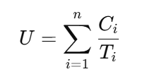
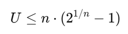

# Escalonador Rate Monotonic (RM)

Este repositório contém um exemplo de implementação de um escalonador baseado no algoritmo **Rate Monotonic (RM)** para tarefas periódicas. O RM é um algoritmo de escalonamento de prioridade fixa onde as tarefas com menor período têm maior prioridade.

## Visão Geral do Projeto

O objetivo deste projeto é determinar a **viabilidade** de um conjunto de tarefas sob o escalonamento RM e fornecer uma **sugestão de escalonamento** com base nos períodos das tarefas.

### Arquivo de Entrada

O arquivo de entrada deve ser um arquivo **JSON** chamado `tarefas.json` contendo uma lista de tarefas periódicas. Cada tarefa possui as seguintes propriedades:

- `id`: Identificador da tarefa
- `execution_time`: Tempo de execução (em unidades de tempo)
- `period`: Período da tarefa (em unidades de tempo)

#### Exemplo de Formato do Arquivo `tarefas.json`

```json
{
    "tasks": [
        {
            "id": 1,
            "execution_time": 3,
            "period": 7
        },
        {
            "id": 2,
            "execution_time": 2,
            "period": 5
        },
        {
            "id": 3,
            "execution_time": 1,
            "period": 3
        }
    ]
}
```
### Processo de Escalonamento

O algoritmo de escalonamento Rate Monotonic (RM) segue os seguintes passos:

1. **Cálculo da Utilização**: A utilização total do sistema é calculada somando-se as razões entre o tempo de execução e o período de cada tarefa. A utilização é dada pela fórmula:

   
    <div align="center">
        
        <p><em>Fórmula de Utilização Total</em></p>
    </div>


   Onde:
   - \( Ci \) é o tempo de execução da tarefa \( i \)
   - \( Ti \) é o período da tarefa \( i \)
   

2. **Condição Suficiente de Viabilidade**: Para garantir que o escalonamento RM será capaz de atender todas as tarefas dentro dos prazos, a utilização total deve ser menor ou igual a um limite teórico calculado pela fórmula:

    <div align="center">
        
        <p><em>Fórmula do limite teórico</em></p>
    </div>
  
    Onde:
    - \( U \) é a utilização total
    - \( n \) é o número total de tarefas

   Esse valor é conhecido como a **condição suficiente de viabilidade**. Se a utilização total for menor ou igual a esse limite, o escalonamento é viável.

3. **Ordenação das Tarefas**: As tarefas são então ordenadas com base no período, atribuindo maior prioridade a aquelas com menor período, seguindo a lógica do RM.

### Saída

Após a verificação da viabilidade e ordenação das tarefas, o código gera um arquivo `resultado.json` contendo:

- **`schedulability`**: Um campo indicando se o escalonamento é `"viable"` ou `"not viable"`.
- **`suggested_schedule`**: Uma lista de tarefas ordenadas por prioridade, onde a tarefa de maior prioridade recebe `priority: 1`.

#### Exemplo de Saída `resultado.json`

```json
{
    "schedulability": "viable",
    "suggested_schedule": [
        {
            "id": 3,
            "priority": 1
        },
        {
            "id": 2,
            "priority": 2
        },
        {
            "id": 1,
            "priority": 3
        }
    ]
}
```
### Como Funciona o Código

1. O código lê o arquivo `tarefas.json` e extrai a lista de tarefas.
2. A utilização total é calculada somando as frações `execution_time / period` para cada tarefa.
3. O limite de utilização é calculado pela fórmula anteriormente especificada.
4. Se a utilização total for menor ou igual ao limite calculado, o escalonamento é considerado viável. Caso contrário, é considerado inviável.
5. As tarefas são ordenadas de acordo com seus períodos, de forma que a tarefa com menor período recebe maior prioridade.
6. A saída com o status de escalonamento e a sugestão de prioridades é gravada no arquivo `resultado.json`.

### Como Usar

1. Prepare um arquivo `tarefas.json` com a lista de tarefas no formato condizente ao presente neste repositório.
2. Execute o script Python.
3. Verifique o resultado gerado no arquivo `resultado.json`.

#### Demonstração

* https://youtu.be/D3MWegfCpt4
